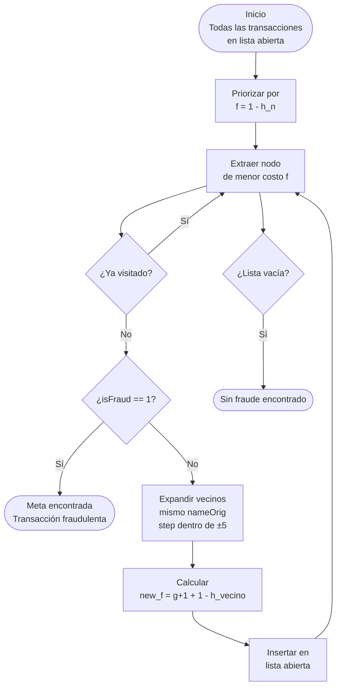
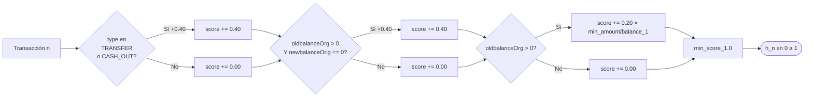

# Formulación del Problema como Agente

**Módulo:** A — Agente y Búsqueda / CSP  
**Responsable:** Jackeline Sanchez  
**Dominio:** Detección de Fraude Financiero  
**Dataset:** PaySim — 6,362,620 transacciones bancarias

---

## Dominio

Sistema de detección de fraude financiero sobre transacciones bancarias del dataset PaySim (6,362,620 registros). El agente evalúa transacciones individuales y navega el grafo de actividad por cuenta para identificar patrones fraudulentos.

---

## Estado

Cada **estado** es una transacción individual representada como un vector de características:

```text
estado = (step, type, amount, nameOrig, oldbalanceOrg, newbalanceOrig,
          nameDest, oldbalanceDest, newbalanceDest)
```

- `step`: unidad de tiempo (1 hora simulada)
- `type`: categoría de la transacción (`TRANSFER`, `CASH_OUT`, `PAYMENT`, `DEBIT`, `CASH_IN`)
- `amount`: monto de la transacción
- `nameOrig` / `nameDest`: identificadores de cuenta origen y destino
- `oldbalanceOrg` / `newbalanceOrig`: saldo de la cuenta origen antes y después

---

## Estado Inicial

El agente inicia con la **lista completa de transacciones no revisadas**. En el algoritmo A*, todas las transacciones se insertan en la lista abierta al inicio, priorizadas por su score heurístico de riesgo de fraude `h(n)`.

---

## Estado Meta

Cualquier transacción donde `isFraud == 1`. El agente busca alcanzar este estado con el menor costo de exploración, guiado por la heurística para evitar revisar transacciones legítimas innecesariamente.

---

## Acciones

Desde una transacción `n`, el agente puede **transitar** a transacciones relacionadas:

- **Misma cuenta origen** (`nameOrig` idéntico)
- **Ventana temporal** de ±5 pasos (`|step_vecino - step_n| ≤ 5`)

Esta restricción modela el comportamiento real: las cadenas de fraude ocurren dentro de la misma cuenta en un período corto.

---

## Función de Evaluación

```text
f(n) = g(n) + (1 - h(n))
```

- `g(n)`: costo acumulado = número de transacciones exploradas hasta `n`
- `h(n)`: heurística de riesgo de fraude (valor en [0, 1], admisible)
- `1 - h(n)`: convierte el score de riesgo en costo (mayor riesgo = menor costo = exploración prioritaria)

### Heurística `h(n)` — Justificación

| Componente | Peso | Justificación de dominio |
| --- | --- | --- |
| `type` ∈ {TRANSFER, CASH_OUT} | +0.40 | El 100% del fraude en el dataset ocurre en estos dos tipos |
| Drenaje completo de saldo (`oldbalanceOrg > 0` y `newbalanceOrig == 0`) | +0.40 | Señal más fuerte de fraude: la cuenta es vaciada por completo |
| Ratio `amount / oldbalanceOrg` (normalizado a [0,1]) | +0.20 | Drenajes parciales también correlacionan con fraude |

La heurística es **admisible**: el score máximo es 1.0 y nunca sobreestima el costo real hasta el objetivo.

---

## Diagrama del Ciclo de Búsqueda A*



---

## Diagrama de la Heurística h(n)



---

## Justificación del Algoritmo

Se eligió **A\*** sobre alternativas porque:

- **BFS**: explora transacciones en orden de inserción sin considerar cuán sospechosa es cada una. En un dataset con solo 0.13% de fraude, revisaría cientos de transacciones legítimas antes de encontrar fraude.
- **Greedy Best-First**: solo usa `h(n)`, puede quedarse atrapado en caminos localmente prometedores sin garantía de optimalidad.
- **A\***: combina el costo acumulado `g(n)` con la heurística `h(n)`, garantizando encontrar el fraude con menor cantidad de nodos explorados cuando la heurística es admisible.
