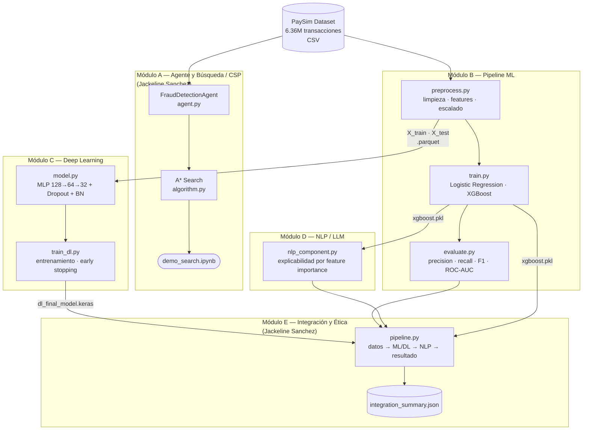
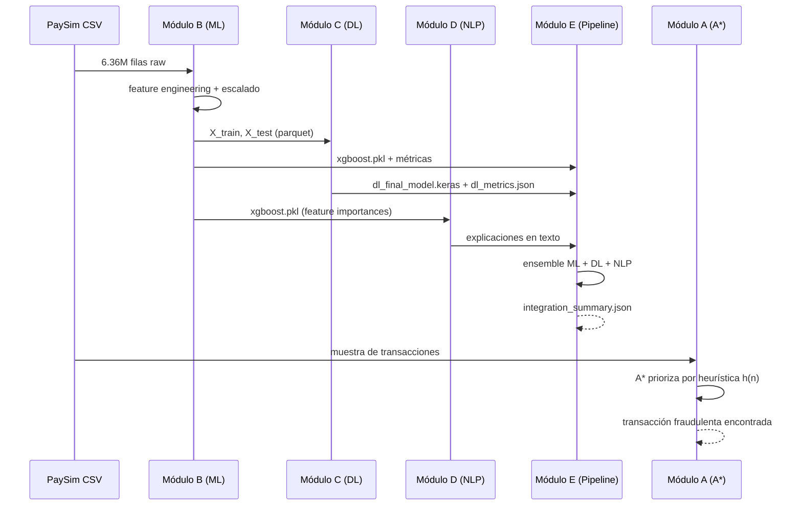
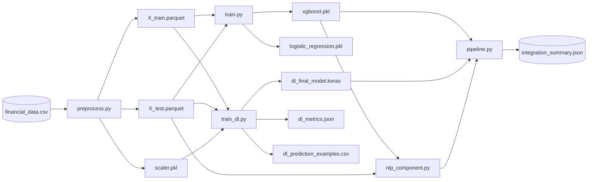

# Arquitectura del Sistema

**Proyecto:** Sistema de IA para Detección de Fraude Financiero  
**Dataset:** PaySim — 6,362,620 transacciones bancarias

---

## Diagrama de Arquitectura General

---

## Flujo de Datos End-to-End

---

## Dependencias entre Artefactos

