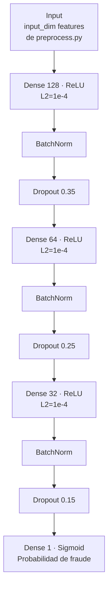
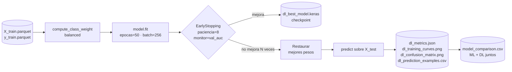

# Decisiones del Modelo Deep Learning

**Modulo:** C - Deep Learning  
**Responsable:** Gabriel Valdez  
**Dominio:** Deteccion de fraude financiero  
**Base de integracion:** Pipeline ML de semana 3 (`src/ml/preprocess.py`)

---

## Diagrama de Arquitectura MLP



## Diagrama del Proceso de Entrenamiento



---

## 1. Objetivo

El objetivo de semana 4 es entrenar una red neuronal que use los mismos datos
preprocesados de semana 3 y permita comparar su rendimiento contra los modelos
clasicos ya evaluados: Logistic Regression y XGBoost.

El problema es clasificacion binaria:

- `0`: transaccion normal
- `1`: transaccion fraudulenta

Como el fraude es una clase extremadamente minoritaria, la evaluacion prioriza
`recall`, `F1`, `ROC-AUC` y `Average Precision`, no solo `accuracy`.

---

## 2. Arquitectura Elegida

Se implemento un perceptron multicapa (MLP) en TensorFlow/Keras:

| Bloque | Configuracion | Justificacion |
|---|---|---|
| Entrada | `input_dim = numero de features procesadas` | Reutiliza las features tabulares de semana 3 |
| Capa 1 | Dense 128 + ReLU | Captura combinaciones no lineales iniciales |
| Regularizacion 1 | BatchNorm + Dropout 0.35 | Reduce sensibilidad a escala y overfitting |
| Capa 2 | Dense 64 + ReLU | Resume interacciones entre variables de saldo, monto y tipo |
| Regularizacion 2 | BatchNorm + Dropout 0.25 | Mantiene generalizacion en clase minoritaria |
| Capa 3 | Dense 32 + ReLU | Compacta la representacion antes de salida |
| Regularizacion 3 | BatchNorm + Dropout 0.15 | Regularizacion menor cerca de la salida |
| Salida | Dense 1 + Sigmoid | Probabilidad de fraude |

### Por que MLP

El dataset es tabular, no secuencial ni de imagen. Por eso una CNN o RNN no
aportaria una inductive bias adecuada. Un MLP es suficiente para modelar
interacciones no lineales entre:

- `amount`
- `oldbalanceOrg`
- `newbalanceOrig`
- `errorBalanceOrig`
- `amountToOrigRatio`
- `isHighRiskType`
- dummies de tipo de transaccion

---

## 3. Hiperparametros

| Hiperparametro | Valor | Razon |
|---|---:|---|
| Optimizador | Adam | Buen punto de partida para redes densas tabulares |
| Learning rate | `0.001` | Convergencia estable sin pasos agresivos |
| Loss | Binary crossentropy | Clasificacion binaria probabilistica |
| Batch size | `256` | Balance entre estabilidad y velocidad |
| Epocas maximas | `50` | Limite superior; early stopping decide el corte real |
| L2 | `1e-4` | Penaliza pesos grandes y reduce overfitting |
| Dropout | `0.35`, `0.25`, `0.15` | Regularizacion decreciente por profundidad |
| Monitor | `val_auc` | Mas informativo que accuracy en clases desbalanceadas |
| Early stopping | paciencia `8` | Detiene cuando no mejora validacion |

---

## 4. Manejo del Desbalanceo

El dataset tiene muchos mas casos normales que fraudes. Para evitar que la red
aprenda a predecir siempre "normal", `train_dl.py` calcula `class_weight` con
`sklearn.utils.class_weight.compute_class_weight`.

Esto aumenta el costo de equivocarse en fraudes durante el entrenamiento sin
duplicar datos ni crear ejemplos sinteticos.

---

## 5. Integracion con Semana 3

El entrenamiento de DL carga los datos desde:

- `data/processed/X_train.parquet`
- `data/processed/X_test.parquet`
- `data/processed/y_train.parquet`
- `data/processed/y_test.parquet`
- `data/processed/scaler.pkl`

Si esos archivos no existen, el script ejecuta el preprocesamiento de semana 3.
Esto mantiene una comparacion justa porque Logistic Regression, XGBoost y el MLP
usan las mismas features y la misma particion train/test.

---

## 6. Artefactos Generados

Al ejecutar:

```bash
python src/dl/train_dl.py
```

se generan:

| Archivo | Descripcion |
|---|---|
| `data/models/dl_best_model.keras` | Mejor checkpoint segun `val_auc` |
| `data/models/dl_final_model.keras` | Modelo final con mejores pesos restaurados |
| `data/models/scaler_dl.pkl` | Scaler usado por el pipeline de semana 3 |
| `data/reports/dl_training_history.csv` | Loss y metricas por epoca |
| `data/reports/dl_training_curves.png` | Curvas de entrenamiento/validacion |
| `data/reports/dl_confusion_matrix.png` | Matriz de confusion del MLP |
| `data/reports/dl_metrics.json` | Accuracy, precision, recall, F1, ROC-AUC y AP |
| `data/reports/dl_prediction_examples.csv` | Ejemplos de aciertos y errores |
| `data/reports/model_comparison.csv` | Comparacion con ML incluyendo el MLP |

---

## 7. Comparacion con ML — Resultados Reales

Métricas obtenidas sobre el mismo test set de 40,000 transacciones (20% de la muestra
de 200K, estratificada). Umbral de decision: 0.5.

| Métrica | Logistic Regression | XGBoost (ML) | MLP (DL) |
| --- | --- | --- | --- |
| Accuracy | 0.9640 | **0.9996** | 0.9891 |
| Precision | 0.5342 | **0.9945** | 0.7936 |
| Recall | 0.9732 | **0.9951** | **0.9945** |
| F1 | 0.6898 | **0.9948** | 0.8828 |
| ROC-AUC | 0.9946 | **0.9999** | 0.9995 |
| Fraudes detectados (TP) | 1,599 / 1,643 | **1,635 / 1,643** | 1,634 / 1,643 |
| Fraudes perdidos (FN) | 44 | **8** | **9** |
| Falsas alarmas (FP) | 1,394 | **9** | 440 |

**Análisis de los resultados:**

- **Recall:** El MLP (0.9945) iguala casi exactamente a XGBoost (0.9951) en recall de fraude.
  Ambos pierden solo 8–9 fraudes de 1,643. Esto confirma que el MLP captura los patrones
  de fraude con efectividad comparable al mejor modelo tabular.

- **Precision:** XGBoost (0.9945) supera ampliamente al MLP (0.7936). El MLP genera
  440 falsas alarmas vs 9 de XGBoost. Esto es el trade-off esperado: la red neuronal
  es más conservadora con sus umbrales de confianza.

- **Trade-off en producción:** En fraude financiero, el recall es la métrica crítica
  (cada FN = fraude no bloqueado = pérdida real). El MLP iguala a XGBoost en recall,
  pero genera 49× más falsas alarmas. Para un banco con 6M transacciones/día, 440 FP/40K
  representa ~66,000 bloqueos erróneos diarios — inaceptable operativamente.

- **Conclusión:** XGBoost supera al MLP en todos los criterios sobre datos tabulares,
  lo que es consistente con la literatura (gradient boosting es estado del arte en tabular).
  El MLP aporta valor como **segunda opinión** en el ensemble del pipeline integrado
  (Módulo E), no como modelo principal de producción.

Los artefactos completos están en `data/reports/model_comparison.csv` y
`data/reports/dl_metrics.json`.

---

## 8. Limitaciones

1. **Datos tabulares:** El MLP no tiene una ventaja estructural tan fuerte como
   XGBoost en este tipo de dataset.
2. **Desbalance extremo:** Aunque se usan pesos por clase, la red puede ser
   sensible al umbral de decision.
3. **Costo computacional:** Entrenar DL es mas lento que Logistic Regression y
   puede requerir GPU para iteraciones grandes.
4. **Generalizacion temporal:** El dataset representa una ventana especifica; en
   produccion se debe monitorear drift y reentrenar.
5. **Umbral fijo:** `0.5` es un punto de partida. Para despliegue real se
   optimizaria por costo esperado de fraude y friccion al cliente.

---

## 9. Defensa Oral

Puntos clave:

- Se eligio MLP porque el problema es tabular y binario.
- Se reutilizo exactamente el pipeline de semana 3 para comparacion justa.
- Se agrego regularizacion: dropout, L2, batch normalization y early stopping.
- Se usaron pesos por clase para atender el desbalance.
- La metrica critica es recall/F1, no accuracy.
- XGBoost puede superar al MLP por ser muy fuerte en datos tabulares; eso no
  invalida el modulo DL, sino que muestra un trade-off realista.
