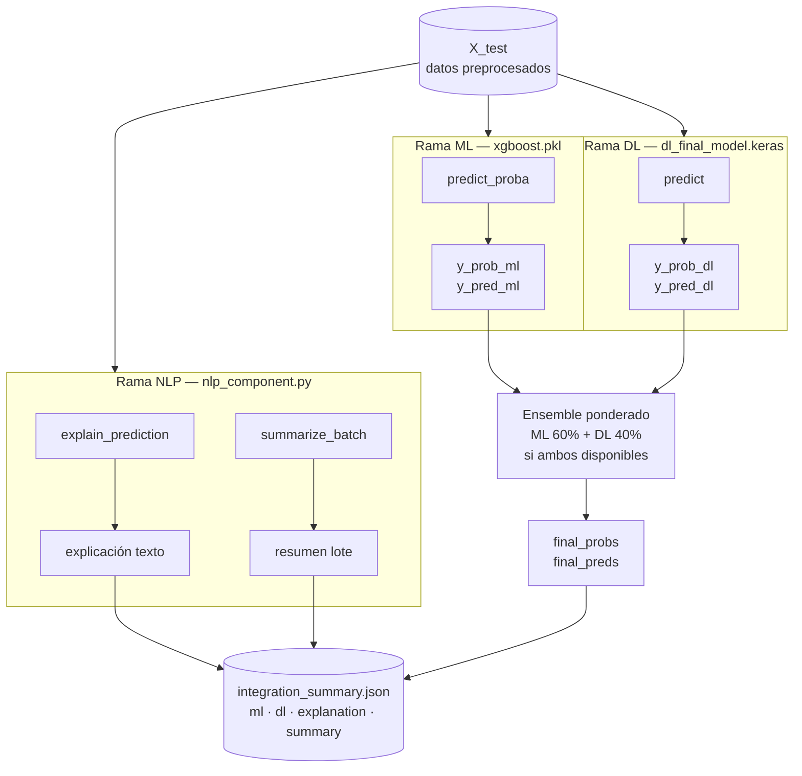

# Análisis Ético del Sistema de IA

**Módulo:** E — Ética, Integración y Documentación  
**Responsable:** Jackeline Sanchez  
**Dominio:** Detección de Fraude Financiero  
**Dataset:** PaySim — 6,362,620 transacciones bancarias

---

## Diagrama del Pipeline Integrado

---

## Contexto
Sistema evaluado: detección de fraude financiero sobre `data/financial_data.csv`.
Pipeline integrado: datos reales -> ML (XGBoost) + DL (MLP) -> NLP (explicación y resumen de riesgo).

## Evidencia Cuantitativa

### Rendimiento global (set de prueba)
- Modelo ML (XGBoost):
	- TP: 1635
	- FN: 8
	- FP: 9
	- TN: 38348
	- Accuracy aprox.: 99.96%
	- Recall fraude aprox.: 99.51%
- Modelo DL (según `data/reports/dl_metrics.json`):
	- accuracy: 0.9891
	- precision: 0.7936
	- recall: 0.9945
	- f1: 0.8828
	- roc_auc: 0.9995

### Fairness por subgrupos (ML)
Se evaluaron subgrupos por tipo de transacción (features one-hot):

- `high_risk_type` (TRANSFER/CASH_OUT):
	- n=18370, fraude real=8.94%, fraude predicho=8.95%
	- recall=0.9951, FPR=0.0005
- `cash_out`:
	- n=14271, fraude real=5.77%, fraude predicho=5.74%
	- recall=0.9903, FPR=0.0003
- `transfer`:
	- n=4099, fraude real=20.00%, fraude predicho=20.13%
	- recall=1.0000, FPR=0.0015
- `payment`:
	- n=12896, fraude real=0.00%, fraude predicho=0.00%

Interpretación:
- El modelo concentra alertas en tipos de alto riesgo del dominio (consistente con el dataset).
- Existe disparidad de prevalencia entre subgrupos, por lo que fairness debe monitorearse por tipo de transacción y no solo globalmente.

## Sesgos Detectados
1. Sesgo de representación del dataset:
- El fraude está asociado casi exclusivamente a TRANSFER/CASH_OUT.
- Esto puede inducir un sesgo estructural: baja sensibilidad a patrones emergentes en tipos históricamente “seguros”.

2. Sesgo por prevalencia extrema:
- Existen subgrupos con prevalencia 0% en test (`payment`).
- Un desempeño perfecto en esos grupos no implica robustez futura ante drift o nuevos esquemas de fraude.

3. Riesgo de sobreconfianza por métricas altas:
- AUC/accuracy altos pueden ocultar costo operativo de FP/FN en producción.

## Limitaciones Técnicas y Éticas
1. Ausencia de variables demográficas:
- No se puede evaluar fairness por atributos sensibles (sexo, etnia, edad).

2. Explicabilidad local aproximada:
- NLP resume e interpreta señales de features; no reemplaza una explicación causal.

3. Generalización temporal no validada explícitamente:
- El entrenamiento/evaluación actual no incorpora evaluación temporal tipo backtesting por ventana.

4. Dependencia de umbral fijo (0.5):
- El costo de FN/FP puede requerir umbrales distintos según política de riesgo.

## Riesgos de Uso Irresponsable
1. Bloqueo automático sin revisión humana:
- Puede producir fricción o rechazo injustificado a clientes legítimos (FP).

2. Uso del score como verdad absoluta:
- Decisiones crediticias o de bloqueo sin contexto pueden amplificar errores del modelo.

3. Falta de monitoreo post-despliegue:
- Sin monitoreo de drift, el modelo puede degradarse y dejar pasar fraude nuevo.

4. Exposición de explicaciones sensibles:
- Explicaciones operativas detalladas podrían ser explotadas por atacantes para evadir detección.

## Mitigaciones Propuestas
1. Gobernanza de decisión humana-en-el-circuito:
- Bloqueo automático solo en score muy alto; revisión manual en banda intermedia.

2. Ajuste de umbral por costo de negocio:
- Definir umbral basado en costo FN vs FP y no por convención 0.5.

3. Monitoreo continuo de fairness y drift:
- Reporte semanal por subgrupo (`type_*`, `isHighRiskType`): recall, FPR, volumen de alertas.

4. Pruebas de robustez temporal:
- Backtesting por ventanas y recalibración periódica del modelo.

5. Control de explicaciones en producción:
- Mostrar explicación resumida para analistas internos; no exponer variables críticas al usuario final.

## Conclusión Ética
El sistema es técnicamente sólido para detección de fraude en el dominio actual, pero su uso responsable requiere controles operativos explícitos: revisión humana, monitoreo de fairness por subgrupos, gestión de drift y políticas de explicabilidad seguras. Sin estos controles, el riesgo principal no es la baja precisión, sino el uso excesivamente automático de un modelo estadístico en decisiones de alto impacto.
