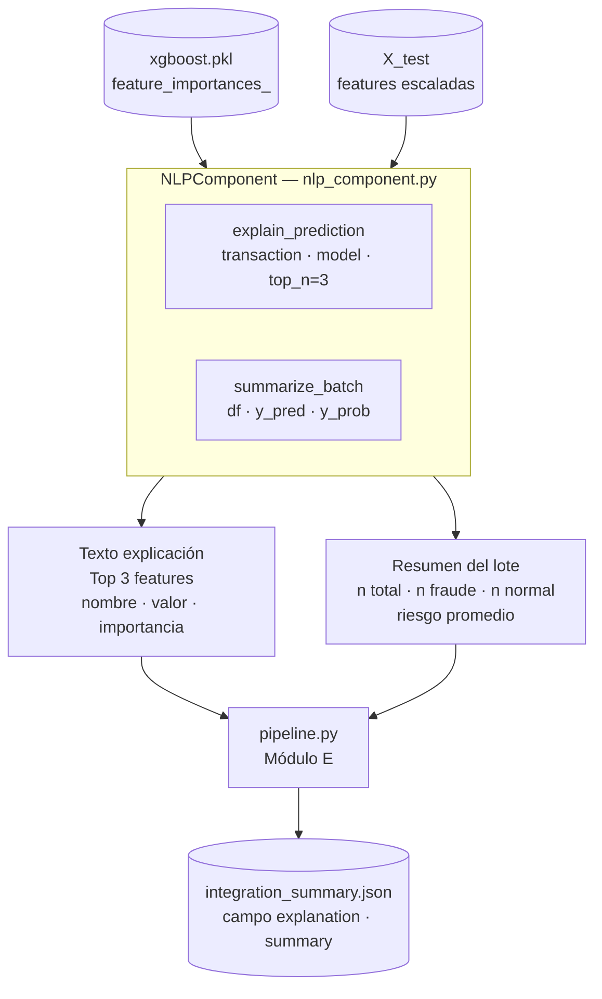

# Decisiones del Componente NLP

**Módulo:** D — NLP / LLM  
**Responsable:** Daniel Galvan  
**Dominio:** Detección de Fraude Financiero  
**Dataset:** PaySim — 6,362,620 transacciones bancarias

---

## 1. Contexto y Desafío

El dataset PaySim no contiene texto libre. Todas las columnas son numéricas o categóricas
(`step`, `amount`, `type`, `oldbalanceOrg`, etc.). El componente NLP debe aportar valor
sobre datos estructurados, no sobre texto de entrada real.

**Estrategia adoptada:** Usar el componente NLP como capa de **explicabilidad** del sistema:
convertir las predicciones numéricas del modelo ML en lenguaje natural comprensible para
analistas humanos.

---

## Diagrama del Componente NLP



---

## 2. Componente Implementado

`src/nlp/nlp_component.py` implementa la clase `NLPComponent` con dos métodos:

### `explain_prediction(transaction, model, top_n=3)`

Genera una explicación textual de por qué una transacción fue clasificada como fraude.

**Mecanismo:**
1. Extrae importancias globales del modelo (`feature_importances_` en XGBoost, `coef_` en LR)
2. Multiplica el valor de cada feature por su importancia: `score = |valor × importancia|`
3. Selecciona las `top_n` features con mayor score
4. Genera texto narrativo con nombre, valor e importancia de cada feature

**Ejemplo de salida real** (del notebook `nlp_demo.ipynb`):
```
Explicación de la predicción:
Los siguientes atributos influyeron más en la decisión del modelo:
- origBalanceZero: valor=1.00, importancia=0.52
- errorBalanceOrig: valor=-0.32, importancia=0.45
- isHighRiskType: valor=1.00, importancia=0.01
```

### `summarize_batch(df, y_pred, y_prob)`

Genera un resumen textual de un lote de predicciones.

**Ejemplo de salida real** (test set de 40,000 transacciones):
```
Se analizaron 40000 transacciones.
- 1644 fueron clasificadas como FRAUDE.
- 38356 como normales.
El riesgo promedio estimado fue de 4.12%.
```

---

## 3. Justificación del Enfoque

### Por qué explicabilidad basada en feature importance

| Criterio | Feature Importance (elegido) | API de LLM (OpenAI/Claude) | BERT fine-tuning |
| --- | --- | --- | --- |
| Requiere internet / API key | No | Sí | No |
| Reproducible offline | Sí | No | Sí |
| Costo operativo | Cero | USD por llamada | GPU para entrenar |
| Coherente con el modelo ML | Sí (usa mismas importancias) | No (genera texto propio) | No |
| Tiempo de respuesta | < 1ms | 1–3 segundos | ~100ms |
| Texto real vs. generado | Usa datos reales del modelo | Puede alucintar | Depende del fine-tuning |

**Decisión:** El enfoque de feature importance es el más coherente con el dominio porque
la explicación proviene directamente del modelo que tomó la decisión — no de un sistema
externo que puede contradecir o malinterpretar la predicción.

### Por qué no BERT fine-tuning

BERT requiere texto de entrada para su ventaja semántica. Con datos tabulares convertidos
a narrativa, BERT no agrega valor semántico sobre TF-IDF o feature importance. El costo
computacional (GPU + horas de entrenamiento) no se justifica para narrativas generadas.

### Por qué no OpenAI API

- Introduce dependencia de conectividad y costo por llamada
- El LLM puede generar explicaciones plausibles pero incorrectas (alucinación)
- No tiene acceso a los pesos internos del modelo ML, por lo que su explicación
  no refleja la decisión real sino una interpretación heurística

---

## 4. Evaluación Crítica — Limitación y Caso de Falla

### Limitación principal: explicación basada en importancia global, no local

`feature_importances_` de XGBoost son importancias **globales** — promedian la contribución
de cada feature sobre todo el dataset de entrenamiento. Para una transacción específica,
la feature más importante globalmente puede no ser la que más influyó en esa predicción
concreta.

**Alternativa para importancia local:** SHAP (SHapley Additive exPlanations) calcula
la contribución exacta de cada feature para cada predicción individual. Se descartó
por complejidad de integración en el tiempo disponible.

### Caso de falla documentado (False Negatives)

Del notebook `nlp_demo.ipynb`, examinando los False Negatives (fraudes no detectados
por XGBoost):

```
Transacción FN ejemplo:
  type_CASH_OUT=True, origBalanceZero=1, isHighRiskType=1
  fraud_probability=0.000235  ← modelo predice como legítima
  actual: isFraud=1           ← es realmente fraude
```

**Comportamiento del NLP:** Como `y_pred=0` (el modelo no detectó fraude), el componente
NLP **no genera alerta** para esta transacción. La explicación diría que el riesgo es bajo,
aunque la transacción es fraudulenta.

**Causa raíz:** El componente NLP es un post-procesador del modelo ML — no puede detectar
fraudes que el modelo no detectó. Si el modelo tiene un FN, el NLP también lo tiene.

**Mitigación propuesta:** Agregar una verificación independiente de reglas de dominio
dentro del componente NLP (p.ej., si `origBalanceZero=1` y `isHighRiskType=1`, generar
una advertencia aunque el score del modelo sea bajo).

### Limitación de valores escalados en la explicación

Los valores mostrados en la explicación (`valor=-0.32`, `valor=1.00`) son valores
**escalados** por `StandardScaler`, no los valores originales de la transacción.
Para un analista humano, `errorBalanceOrig=-0.32` no es interpretable directamente.

**Impacto:** La explicación es técnicamente correcta pero requiere que el analista
entienda que los valores están normalizados.

---

## 5. Integración con el Sistema

El componente NLP recibe las salidas del Módulo B (ML) y Módulo C (DL):

| Entrada | Origen | Uso |
| --- | --- | --- |
| `X_test` (features procesadas) | Módulo B (`preprocess.py`) | Identificar features relevantes |
| Modelo ML entrenado | Módulo B (`xgboost.pkl`) | Extraer `feature_importances_` |
| `y_pred`, `y_prob` | Módulos B y C (predicciones) | Generar resumen del lote |

**Salida hacia Módulo E:** El pipeline (`pipeline.py`) llama a `NLPComponent.explain_prediction()`
y `summarize_batch()` para incluir explicaciones en el JSON de resultado final
(`data/reports/integration_summary.json`).

---

## 6. Artefactos Generados

| Artefacto | Descripción |
| --- | --- |
| Salida en consola / notebook | Explicaciones de transacciones individuales |
| `data/reports/integration_summary.json` | Incluye campo `"explanation"` y `"summary"` por rama (ML/DL) |

El componente no guarda modelos propios — opera sobre el modelo ML ya entrenado.
